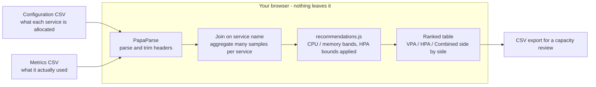

# infra-optimizer


A browser tool that reads Kubernetes CPU and memory usage exports and recommends
what to shrink. It compares what each service is *given* against what it actually
*used*, then proposes new limits, a new pod count, or both.

Everything runs client side. You upload two CSVs, the analysis happens in the
browser, and nothing is sent anywhere. That is deliberate: capacity exports name
your services and describe your topology, so they should not need to leave your
machine to be useful.

## Why it exists

Right-sizing a JVM fleet by hand does not scale. The usage data is already in
Prometheus or your cloud console, but turning it into a concrete "this service
should go from 8 CPU to 3" list means a spreadsheet per service, and nobody keeps
that up. This collapses the spreadsheet step into one screen and produces a diff
you can take to a capacity review.

## Quick start

```bash
npm install
npm start
```

Opens at `http://localhost:3000`. Click **Load Sample Data** to see it work
before you export anything real. Synthetic fixtures also live in `sample-data/`.

### Sample data from a real production trace

The hand-written fixtures show the schema and little else. Real fleets look
different: a long tail of near-idle machines, a few pinned ones, and peaks
nowhere near the average. `sample-data/azure/` holds a set built from the
[Azure Public Dataset](https://github.com/Azure/AzurePublicDataset), Microsoft's
2019 production VM trace, and you can regenerate it:

```bash
node scripts/fetch-azure-sample.mjs --out sample-data/azure --services 10 --samples 8
```

The source file is ~440 MB compressed. The script streams it and aborts the
request once it has enough rows, so the transfer is a few megabytes and the run
takes under a second. Nothing is vendored beyond the generated CSVs.

Read [`sample-data/azure/ATTRIBUTION.md`](sample-data/azure/ATTRIBUTION.md)
before drawing conclusions from it. **The CPU columns are real production
measurements. The memory columns and the replica counts are not**, because a VM
trace contains neither, so they are generated from the CPU figures instead. The
dataset is CC-BY-4.0 while this repository is MIT, which is why the attribution
sits next to the files.

## How it works



No server, no API key, no `.env`: the analysis is a pure function of the two
files you drop in, which is why capacity exports naming your services never
have to leave your machine.

## Input format

Two CSVs, joined on service name.

**Configuration** (what the service is allocated):

| Column | Meaning |
|---|---|
| `Display Name` | Service name, the join key |
| `Cpu Limit` | Current CPU limit |
| `Memory Limit` | Current memory limit, GB |
| `Min` / `Max` | HPA bounds |
| `Current` / `Desired` | Pod counts |

**Metrics** (what it actually used). One row per observation, so multiple rows
per service are expected and get aggregated:

| Column | Meaning |
|---|---|
| `Container Name` | Must match `Display Name` |
| `Cpu %` | Average CPU utilisation |
| `Max Cpu %` | Peak CPU utilisation |
| `Avg Memory %` | Average memory utilisation |
| `Max Memory %` | Peak memory utilisation |

Any export that produces these columns works. A Grafana panel CSV download or a
Prometheus range query flattened to CSV are both fine.

## Strategies

The tool reports three side by side rather than picking for you:

- **VPA only** changes CPU and memory limits, pod count untouched.
- **HPA only** changes pod count, limits untouched.
- **Combined** changes both.

Combined saves the most on paper and is the one to be most careful with, because
you are moving two variables at once against a single set of observations.

The `Min` and `Max` columns are treated as binding: a recommendation is never
below your HPA floor or above its ceiling. A plan the autoscaler would
immediately undo is not a saving, it is a number in a spreadsheet.

## How the recommendation is derived

Both average and peak are used. Average alone over-shrinks anything spiky;
peak alone leaves idle services fat. Roughly:

CPU is cut hardest below 2% average utilisation, progressively less through the
2-10% and 10-20% bands, and scaled *up* past 70%. Memory follows the same shape
with higher thresholds, since JVM heap does not release the way CPU does: cuts
below 20% and 30% average, increases past 80%. Pod count moves on both signals
together, so a service only loses replicas when CPU *and* memory are both low.

Exact bands are in `src/utils/recommendations.js`, which is a plain module
with no React in it — so the sizing rules can be read, tested and changed
without touching the UI. `src/utils/recommendations.test.js` pins every
band boundary.

## The caveat that matters

These thresholds are opinionated defaults, not a safety guarantee. The tool sees
a usage window and nothing else. It does not know about your traffic seasonality,
a launch next week, JVM warmup behaviour, pod disruption budgets, or the fact
that one of those services is the thing everything else calls.

Treat the output as a ranked list of candidates for a human to review, and roll
changes out one service at a time with headroom to revert. "Ultra-aggressive" is
the label on a setting, not advice.

## Built with

React 18, Tailwind, PapaParse for CSV, Lodash, Lucide for icons.

## Contributing

Bug reports and pull requests are welcome. [CONTRIBUTING.md](CONTRIBUTING.md)
covers the setup and the gate that must be green before a PR. Everyone taking
part is expected to follow the [Code of Conduct](CODE_OF_CONDUCT.md).

For a security problem, do not open an issue: see [SECURITY.md](SECURITY.md).

## License

MIT. See [LICENSE](LICENSE).
